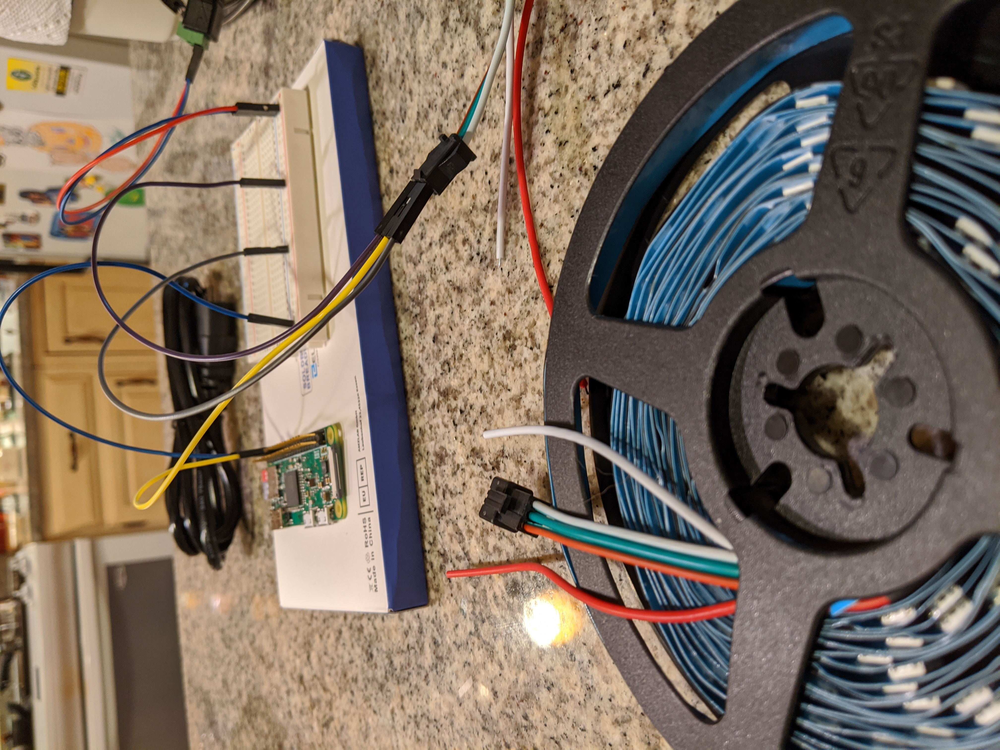
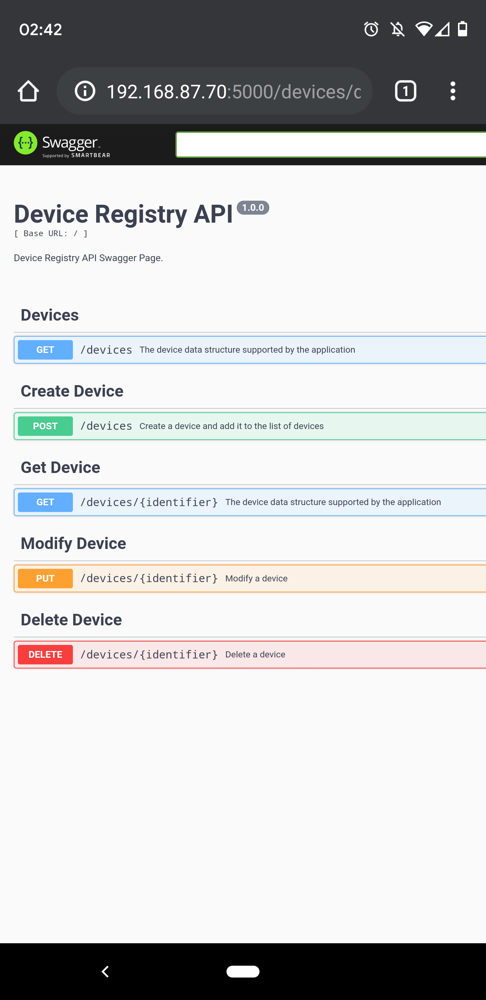
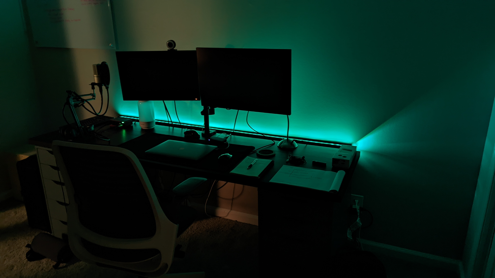

# Smarty Lamps Shots

Here is a collection of photos, videos and screenshots over the course
of building SmartyLamps, demonstrating its API capabilities, user interface,
and working hardware components.

For years, this has been deployed to a Raspberry Pi Zero W to run
an ambient lighting setup in my office.

### Building It:

### Demos
### [UI](https://drive.google.com/file/d/14MdWSIHNtjJiaogRDKhOLUinKDa3dhpI/view?usp=drive_link)

### [Animation](https://drive.google.com/file/d/1ma031U0bMTgKzQBoCqjF0j89lbs0aD46/view?usp=drive_link)

### Swagger Page

### Desk View:

